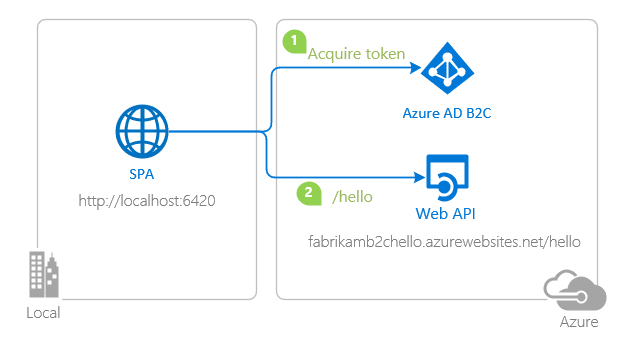

# JavaScript single-page application secured with MSAL.js using the Authorization Code Flow (PKCE) on Azure AD B2C

 1. [Overview](#overview)
 1. [Scenario](#scenario)
 1. [Contents](#contents)
 1. [Prerequisites](#prerequisites)
 1. [Setup](#setup)
 1. [Registration](#registration)
 1. [Running the sample](#running-the-sample)
 1. [Explore the sample](#explore-the-sample)
 1. [Deployment](#deployment)
 1. [More information](#more-information)
 1. [Community Help and Support](#community-help-and-support)
 1. [Contributing](#contributing)

## Overview

This sample demonstrates a vanilla JavaScript single-page application (SPA) that lets users authenticate against [Azure Active Directory B2C](https://azure.microsoft.com/services/active-directory/external-identities/b2c/) (Azure AD B2C) using the [Microsoft Authentication Library for JavaScript](https://github.com/AzureAD/microsoft-authentication-library-for-js) (MSAL.js) and authorize them to call a web API that is also protected by **Azure AD B2C**. This sample also demonstrates sign-up/sign-in, password reset and profile edit [user-flows](https://docs.microsoft.com/azure/active-directory-b2c/user-flow-overview).

## Scenario

1. The client application uses the **MSAL.js** to obtain an **Access Token** from **Azure AD B2C**.
1. The **Access Token** is used as a **bearer** to *authorize* the user to call a protected web API.
1. The protected web API responds with the name of the signed-in user.



If you like, you can take a [quick look at the application](https://azure-samples.github.io/ms-identity-b2c-javascript-spa/) before trying.

## Contents

| File/folder           | Description                                |
|-----------------------|--------------------------------------------|
| `App/authPopup.js`    | Main authentication logic resides here (using popup flow). |
| `App/authRedirect.js` | Use this instead of `authPopup.js` for authentication with redirect flow. |
| `App/authConfig.js`   | Contains configuration parameters for the sample. |
| `App/apiConfig.js`    | Contains web API scopes and coordinates. |
| `App/policies.js`     | Contains B2C custom policies and user-flows.  |

## Prerequisites

- [Node.js](https://nodejs.org/en/download/) must be installed to run this sample.
- [Visual Studio Code](https://code.visualstudio.com/download) is recommended for running and editing this sample.
- [VS Code Azure Tools](https://marketplace.visualstudio.com/items?itemName=ms-vscode.vscode-node-azure-pack) extension is recommended for interacting with Azure through VS Code Interface.
- A modern web browser. This sample uses **ES6** conventions and will not run on **Internet Explorer**.
- An Azure AD B2C tenant. For more information, see: [Create an Azure Active Directory B2C tenant](https://docs.microsoft.com/azure/active-directory-b2c/tutorial-create-tenant)
- A user account in your Azure AD B2C tenant.

## Setup

### Step 1: Clone or download this repository

From your shell or command line:

```console
git clone https://github.com/Azure-Samples/ms-identity-b2c-javascript-spa.git
```

or download and extract the repository .zip file.

> :warning: Given that the name of the sample is quite long, and so are the names of the referenced packages, you might want to clone it in a folder close to the root of your hard drive, to avoid maximum file path length limitations on Windows.

### Step 2: Install project dependencies

```console
    cd ms-identity-b2c-javascript-spa
    npm install
```

## Registration

> :information_source: This sample comes with a pre-registered application for testing purposes. If you would like to use your own **Azure AD B2C** tenant and application, follow the steps below to register and configure the applications in the **Azure Portal**. Otherwise, continue with the steps for [Running the sample](#running-the-sample).

### Choose the Azure AD B2C tenant where you want to create your applications

As a first step you'll need to:

1. Sign in to the [Azure portal](https://portal.azure.com).
1. If your account is present in more than one **Azure AD B2C** tenant, select your profile at the top right corner in the menu on top of the page, and then **switch directory** to change your portal session to the desired **Azure AD B2C** tenant.

### Register the service app (Node.js web API)

> :information_source: This sample is calling a web API that is already protected by **Azure AD B2C** and hosted on **Azure App Service**. If you would like to setup and use your own web API, follow the instructions on [Add a web API application and Configure scopes](https://docs.microsoft.com/azure/active-directory-b2c/tutorial-single-page-app-webapi?tabs=app-reg-ga#add-a-web-api-application) or see [Node.js Web API with Azure AD B2C](https://github.com/Azure-Samples/active-directory-b2c-javascript-nodejs-webapi) code sample.

#### Register the client app (JavaScript SPA)

1. Navigate to the Microsoft identity platform for developers [App registrations](https://go.microsoft.com/fwlink/?linkid=2083908) page.
1. Select **New registration**.
1. In the **Register an application page** that appears, enter your application's registration information:
   - In the **Name** section, enter a meaningful application name that will be displayed to users of the app, for example `ms-identity-b2c-javascript-spa`.
   - Under **Supported account types**, select **Accounts in any organizational directory or any identity provider**.
   - In the **Redirect URI (optional)** section, select **Single-page application** in the combo-box and enter the following redirect URI: `http://localhost:6420`.
1. Select **Register** to create the application.
1. In the app's registration screen, find and note the **Application (client) ID**. You use this value in your app's configuration file(s) later in your code.
1. Select **Save** to save your changes.
1. In the app's registration screen, click on the **API Permissions** blade in the left to open the page where we add access to the APIs that your application needs.
    - Click the **Add a permission** button and then,
    - Ensure that the **My APIs** tab is selected.
    - In the list of APIs, select the name of the API you've created during the **Register the service app** step.
    - In the **Delegated permissions** section, select the **demo.read** in the list. Use the search box if necessary.
    - Click on the **Add permissions** button at the bottom.
    - Click on the **Grant admin consent** button at the top.

### Create User Flows

Please refer to: [Tutorial: Create user flows in Azure Active Directory B2C](https://docs.microsoft.com/azure/active-directory-b2c/tutorial-create-user-flows)

### Add External Identity Providers

Please refer to: [Tutorial: Add identity providers to your applications in Azure Active Directory B2C](https://docs.microsoft.com/azure/active-directory-b2c/tutorial-add-identity-providers)

#### Configure the app (JavaScript SPA) to use your app registration

Open the project in your IDE (like Visual Studio Code) to configure the code.

> In the steps below, "ClientID" is the same as "Application ID" or "AppId".

Open the `App\authConfig.js` file. Then:

1. Find the key `clientId` and replace the existing value with the application ID (clientId) of the `ms-identity-b2c-javascript-spa` application copied from the Azure portal.
1. Find the key `redirectUri` and replace the existing value with the base address of the ms-identity-b2c-javascript-spa project (by default `http://localhost:6420`).

Open the `App\policies.js` file. Then:

1. Find the key `policies.names` and replace it with the names (IDs) of your policies/user-flows e.g. `b2c_1_susi_reset_v2`.
1. Find the key `policies.authorities` abd replace it with the authority strings of your policies/user-flows e.g. `https://fabrikamb2c.b2clogin.com/fabrikamb2c.onmicrosoft.com/b2c_1_susi_reset_v2`.
1. Find the key `policies.authorityDomain` abd replace it with the domain of your authority e.g. `fabrikamb2c.b2clogin.com`.

Open the `App\apiConfig.js` file. Then:

1. Find the key `b2cScopes` and replace the existing value with the scope of your web API (if you have followed the [Tutorial: Node.js Web API with Azure AD B2C](https://github.com/Azure-Samples/active-directory-b2c-javascript-nodejs-webapi) above, this is `api://{your-web-apis-client-id}/demo.read`).
1. Find the key `webAPI` and replace the existing value with the coordinates of your web API (if you have followed the [Tutorial: Node.js Web API with Azure AD B2C](https://github.com/Azure-Samples/active-directory-b2c-javascript-nodejs-webapi) above, this is `http://localhost:5000`).

## Running the sample

```console
    cd ms-identity-b2c-javascript-spa
    npm start
```

## Explore the sample

1. Open your browser and navigate to `http://localhost:6420`.
1. Click on the **sign-in** button on the top right corner.


> :thought_balloon: How did we do? Consider taking a moment to [share your experience with us](https://forms.office.com/Pages/ResponsePage.aspx?id=v4j5cvGGr0GRqy180BHbR73pcsbpbxNJuZCMKN0lURpUMlZNRk1CUlk4NU5YTVNNWVpBMUYwRlBGMiQlQCN0PWcu)

## Deployment

### Deployment to Azure Storage

There is one single-page application in this sample. To deploy it to **Azure Storage**, you'll need to:

- create an Azure Storage blob
- build your project and upload it
- update config files with website coordinates

If you are going to call a web API from a your deployed SPA, you'll also need to configure your web API's **CORS** setting accordingly (more on this below).

> :information_source: If you would like to use **VS Code Azure Tools** extension for deployment, [watch the tutorial](https://docs.microsoft.com/azure/developer/javascript/tutorial-vscode-static-website-node-01) offered by Microsoft Docs.

#### Build and upload the `ms-identity-b2c-javascript-spa` to an Azure Storage blob

Build your project to get a distributable files folder, where your built `html`, `css` and `javascript` files will be generated. Then follow the steps below:

> :warning: When uploading, make sure you upload the contents of your distributable files folder and **not** the entire folder itself.

1. Sign in to the [Azure portal](https://portal.azure.com).
1. Locate your storage account and display the account overview.
1. Select **Static website** to display the configuration page for static websites.
1. Select **Enabled** to enable static website hosting for the storage account.
1. In the **Index document name** field, specify a default index page (For example: `index.html`).
1. The default **index page** is displayed when a user navigates to the root of your static website.
1. Click **Save**. The Azure portal now displays your static website endpoint. Make a note of the **Primary endpoint field**.
1. In the `ms-identity-b2c-javascript-spa` project source code, update your configuration file with the **Primary endpoint field** as your new **Redirect URI** (you will register this URI later).
1. Next, select **Storage Explorer**.
1. Expand the **BLOB CONTAINERS** node, and then select the `$web` container.
1. Choose the **Upload** button to upload files.
1. If you intend for the browser to display the contents of file, make sure that the content type of that file is set to `text/html`.
1. In the pane that appears beside the **account overview page** of your storage account, select **Static Website**. The URL of your site appears in the **Primary endpoint field**. In the next section, you will register this URI.

### Update the Azure AD B2C app registration for `ms-identity-b2c-javascript-spa`

1. Navigate back to to the [Azure portal](https://portal.azure.com).
1. In the left-hand navigation pane, select the **Azure AD B2C** service, and then select **App registrations**.
1. In the resulting screen, select the `ms-identity-b2c-javascript-spa` application.
1. Add the same URI in the list of values of the *Authentication -> Redirect URIs* menu. If you have multiple redirect URIs, make sure that there's a new entry using the **Azure Storage**'s static website endpoint URI for each redirect URI.

### CORS configuration for web API to allow calls from this SPA

Now you need to navigate to the Azure App Service Portal, and locate your web API there. Once you do, click on the **CORS** blade. There, add your deployed SPA's coordinates as an allowed domain:


## More information

Configure your application:

- [Use Microsoft Authentication Library for JavaScript to work with Azure AD B2C](https://docs.microsoft.com/azure/active-directory/develop/msal-b2c-overview)
- [Tutorial: Create an Azure Active Directory B2C tenant](https://docs.microsoft.com/azure/active-directory-b2c/tutorial-create-tenant)
- [Single sign-on with MSAL.js](https://docs.microsoft.com/azure/active-directory/develop/msal-js-sso)
- [Handle MSAL.js exceptions and errors](https://docs.microsoft.com/azure/active-directory/develop/msal-handling-exceptions?tabs=javascript)
- [Logging in MSAL.js applications](https://docs.microsoft.com/azure/active-directory/develop/msal-logging?tabs=javascript)

Learn more about **Microsoft Identity Platform** and **Azure AD B2C**:

- [Microsoft identity platform (Azure Active Directory for developers)](https://docs.microsoft.com/azure/active-directory/develop/)
- [Overview of Microsoft Authentication Library (MSAL)](https://docs.microsoft.com/azure/active-directory/develop/msal-overview)
- [What is Azure Active Directory B2C?](https://docs.microsoft.com/azure/active-directory-b2c/overview)
- [Azure AD B2C User Flows](https://docs.microsoft.com/azure/active-directory-b2c/user-flow-overview)
- [Azure AD B2C Custom Policies](https://docs.microsoft.com/azure/active-directory-b2c/custom-policy-overview)

See more code samples:

- [MSAL B2C code samples](https://docs.microsoft.com/azure/active-directory-b2c/code-samples)

For more information about how OAuth 2.0 protocols work in this scenario and other scenarios, see [Authentication Scenarios for Azure AD](https://docs.microsoft.com/azure/active-directory/develop/authentication-flows-app-scenarios).

## Community Help and Support

Use [Stack Overflow](http://stackoverflow.com/questions/tagged/msal) to get support from the community.
Ask your questions on Stack Overflow first and browse existing issues to see if someone has asked your question before.
Make sure that your questions or comments are tagged with [`azure-ad-b2c` `ms-identity` `adal` `msal`].

If you find a bug in the sample, please raise the issue on [GitHub Issues](../../issues).

To provide a recommendation, visit the following [User Voice page](https://feedback.azure.com/forums/169401-azure-active-directory).

## Contributing

If you'd like to contribute to this sample, see [CONTRIBUTING.MD](/CONTRIBUTING.md).

This project has adopted the [Microsoft Open Source Code of Conduct](https://opensource.microsoft.com/codeofconduct/). For more information, see the [Code of Conduct FAQ](https://opensource.microsoft.com/codeofconduct/faq/) or contact [opencode@microsoft.com](mailto:opencode@microsoft.com) with any additional questions or comments.
